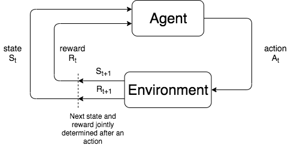
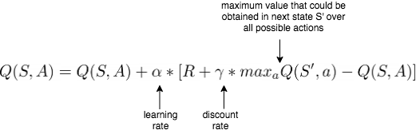

# Cartpole Agent

  Agent Training           |   Agent Testing
:-------------------------:|:-------------------------:
  |  

This directory contains Reinforcement Learning agent(s) to solve the [cartpole balancing](https://en.wikipedia.org/wiki/Inverted_pendulum) problem simulated by the [OpenAI Cartpole-v0 Gym](https://github.com/openai/gym/wiki/CartPole-v0).

## Directory Layout

Take note of the following files.

* `qcartpole_agent.py` : A Q-learning agent to solve the Cartpole-v0 problem
* `cartpole_artefacts.npy` : Artefacts from training the Q-learning agent is stored in this Numpy file for later reuse
* `run_agent.py` : Launches the Q-learning agent in train or test mode
* `grid_search.py` : Grid search to find the best parameter set in the hyperparameter space of the Q-learning agent. Hyperarameters of significance include the learning-rate, exploration probability, discount-rate, and the 
number of buckets into which the state space is discretized

## Run Instructions

* Run in training mode

    ```bash
    python run_agent.py --mode train
    ```

* Run in testing mode

    ```bash
    python run_agent.py --mode test
    ```

## Problem Setup

This section goes through formulating the cartpole problem as a reinforcement learning (RL) problem, and
steps taken for the RL model to converge and to find a solution. As a prerequisite, please go through
[Cartpole-v0 environment's](https://github.com/openai/gym/wiki/CartPole-v0#Environment) details before proceeding.

We model the Cartpole problem as a [Q-learning problem](https://en.wikipedia.org/wiki/Q-learning) with the
following setup. We use the term `agent` frequently hereafter, which is perceived as an entity that can _evaluate_
its actions by observing the feedback (rewards/penalty) received from its environment.

### State Space

Our agent has a continuous state space, with four state variables: cart-position, cart-velocity, pole-angle,
and pole-velocity (angular velocity). Thinking from its perspective, the state-space is huge and even
infinite with respect to some of the variables like cart-velocity and pole-velocity.

Just for scale, let's jot down quickly some ranges associated with each of the state variables, and
estimate the number of states we could have for our agent.

* Cart-position: [-2.4, 2.4] with a resolution of 0.1 results in about _48 different positions_
* Cart-velocity: Quick break down of the range [-infinity, infinity] to say _100 different velocities_
* Pole Angle: [-41.8, 41.8] degrees with a resolution of 5 degrees results in about _42 different angles_
* Pole Velocity: Breaking it down similar to cart-velocity to say _100 different velocities_

Given the above set of state-variables, we'd have about 20 million states in the agent's memory
and a gargantuan amount of processing power not suitable to most of our development machines.
Hence we need a mechanism through which the dimensionality of state-space could be reduced.

#### Discretizing State Space

In order to reduce the dimensionality and to converge faster, we only consider pole-angle
and pole-velocity in the state space and discretize them into buckets. The idea behind this is that our agent
only needs to learn the actions it needs to take based on the angular properties of the pole, given the
following characteristics of the cart are observed:

* Position would be within the environment throughout the 200 steps a
  [successful episode can have](https://github.com/openai/gym/wiki/CartPole-v0#episode-termination)  
* Its velocity would have a minor or no impact on the actions the agent is supposed to take i.e. move left or move right

### Action Space

The actions that the agent needs to take are fairly simple and discrete: 0 for moving the cart left,
1 for moving it right.

### Brief Introduction to Q-Learning

Let's go through the Q-learning aspect of the agent as it exists in `qcartpole_agent.py`. Q-learning is
an algorithm that approximates the optimal action-value function i.e. the expected (or average)
reward an agent obtains given it picks an action _a_ is estimated.

Take note that Q-learning, also known as Off-policy Temporal Difference control algorithm, is an approach
for solving finite Markov Decision Process (MDP) problems. MDPs formalize problems that need sequential decision
making such that an action taken in a given state could affect rewards received over the long term, and hence
demands a tradeoff between immediate and delayed rewards. A MDP framework capturing an agent's interaction
with its environment is shown in the diagram below.



Q-learning updates a table each of whose entry contains a state-action pair, and their corresponding _values_.
If we consider one such entry with state `s` and action `a`, then the value that it'd would have in the Q-table
would be the action-value or expected reward discussed above, which are received/observed when
an agent takes the action `a` in that state `s`. In general Q-table can summarised by the notation shown here.

```math
Q : (S, A) -> V
```

In the above notation, (S,A) stands for set of state-action pairs and V for expected rewards.

Q-table updates happen according to the equation give below,



where S', R are the state and reward observed from the environment after taking an action in a given state.

#### Adaptive Learning and Exploration

##### Epsilon Greedy Policy

So far we understand that only after an action in a given state say `s`, we receive a reward which then
helps us in updating the Q-table. This action is chosen using something called as epsilon-greedy policy,
which states that with a probability of `epsilon` we choose a random action among all actions available in a
given state. So with the rest of `1-epsilon` probability, we take the action which has the maximum _expected
reward_ from the entries in the Q-table corresponding to that given state.


## References and Attribution

1. Matthew Chan's post on [Cart-Pole Balancing with Q Learning](https://medium.com/@tuzzer/cart-pole-balancing-with-q-learning-b54c6068d947)

2. Ferdinand Mütsch's article on [CartPole with Q-Learning](https://dev.to/n1try/cartpole-with-q-learning---first-experiences-with-openai-gym)

3. [Reinforcement Learning: An Introduction](http://www.andrew.cmu.edu/course/10-703/textbook/BartoSutton.pdf)
by Richard S. Sutton and Andrew G. Barto
