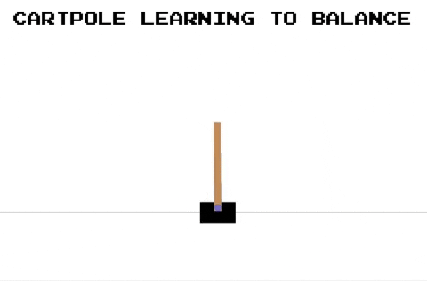

# Cartpole Agent

  Agent Training           |   Agent Testing
:-------------------------:|:-------------------------:
  |  

This directory contains Reinforcement Learning agent(s) to solve the [cartpole balancing](https://en.wikipedia.org/wiki/Inverted_pendulum) problem simulated by the [OpenAI Cartpole-v0 Gym](https://github.com/openai/gym/wiki/CartPole-v0).

## Directory Layout

Take note of the following files.

* `qcartpole_agent.py` : A Q-learning agent to solve the Cartpole-v0 problem
* `cartpole_artefacts.npy` : Artefacts from training the Q-learning agent is stored in this Numpy file for later reuse
* `run_agent.py` : Launches the Q-learning agent in train or test mode
* `grid_search.py` : Grid search to find the best parameter set in the hyperparameter space of the Q-learning agent.
  Hyperarameters of significance include the learning-rate, exploration probability, discount-rate, and the number
  of buckets into which the state space is discretized

## Run Instructions

* Run in training mode

    ```bash
    python run_agent.py --mode train
    ```

* Run in testing mode

    ```bash
    python run_agent.py --mode test
    ```

## Problem Setup

### Discretizing State Space

### Adaptive Learning and Exploration
